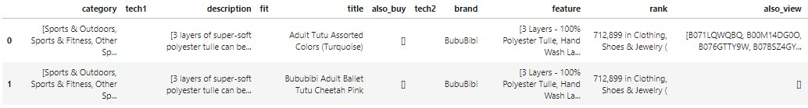
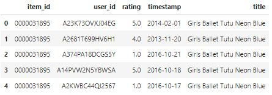
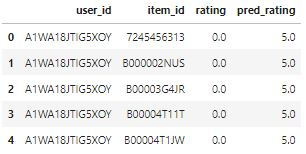

# Рекомендация товаров для активного отдыха
Построить рекомендательную систему на основе данных рейтинга продаж товаров для активного отдыха. Исходные данные по рейтингу продаж товаров на https://nijianmo.github.io/amazon/index.html

## Подключение библиотек
```python
# Импорт основных библиотек
import numpy as np
import pandas as pd

# Импорт вспомогательных библиотек
import json, gzip

# Импорт библиотеки машинного обучения
from sklearn.metrics.pairwise import cosine_similarity
from sklearn.feature_extraction.text import TfidfVectorizer, TfidfTransformer

# Импорт библиотеки рекомендательных систем
from surprise import SVD
from surprise import Dataset, Reader
from surprise import accuracy
from surprise.model_selection.split import train_test_split

# Импорт библиотек построения графиков и диаграмм
import matplotlib.pyplot as plt
import seaborn as sns

# Определение режима вывода диаграмм
%matplotlib inline

# Определение стиля вывода диаграмм
plt.rc('axes', grid=True)
plt.rc('grid', linewidth=0.5)
```
## Загрузка исходных данных
```python
# Функция чтения данных из файла json
def parse_json(path):
    for line in gzip.open(path, 'rb'):
        yield json.loads(line)

# Функция загрузки данных из файла json в датафрейм
def get_dataframe(path):
    data = {}
    for i, item in enumerate(parse_json(path)):
        data[i] = item
        
    return pd.DataFrame.from_dict(data, orient='index')
```

```python
# Загрузка данных по рейтингу продаж товаров для активного отдыха
rating_data = pd.read_csv('Sports_and_Outdoors.csv', names=['asin', 'reviewer_id', 'rating', 'timestamp'])
rating_data.head()
```


```python
# Загрузка данных описания товаров для активного отдыха
description_data = get_dataframe('meta_Sports_and_Outdoors.json.gz')
description_data.head(2)
```


```python
# Объединение загруженных данных в один датафрейм
sports_data = rating_data.merge(description_data[['asin', 'title']].drop_duplicates(), on='asin', how='left')
sports_data.columns = ['item_id', 'user_id', 'rating', 'timestamp', 'title']
sports_data.head()
```


## Разведочный анализ
```python
# Вывод информации о структуре данных
sports_data.info(show_counts=True)
```
```
<class 'pandas.core.frame.DataFrame'>
Int64Index: 12980837 entries, 0 to 12980836
Data columns (total 5 columns):
 #   Column     Non-Null Count     Dtype  
---  ------     --------------     -----  
 0   item_id    12980837 non-null  object 
 1   user_id    12980837 non-null  object 
 2   rating     12980837 non-null  float64
 3   timestamp  12980837 non-null  int64  
 4   title      12963012 non-null  object 
dtypes: float64(1), int64(1), object(3)
memory usage: 594.2+ MB
```

```python
# Вывод списка товаров и количество приобретений
sports_data['item_id'].value_counts()
```
```
B00V6JAEDC    10226
B0017IHRNM     9472
B00G7H793G     8801
B0013092CS     8592
B00FO9ZRYQ     8591
              ...  
B00GDS6SNQ        1
B008QWEO1K        1
B00GDSWXLM        1
B00GDSWM0O        1
B01HJFUCHO        1
Name: item_id, Length: 957764, dtype: int64
```

```python
# Вывод списка покупателей и количество покупок
sports_data['user_id'].value_counts()
```
```
A3OXHLG6DIBRW8    433
AN81JUYW2SL24     373
AVU1ILDDYW301     347
A2O489VAPVIH35    338
A8VI7KMUHI7ZH     310
                 ... 
AX9ZCW551UIPG       1
A1M46R96QQB6U       1
AOZ1B0C6T1Z8F       1
A36VPNKL3QDE6F      1
A1OJNTT9ZTT82A      1
Name: user_id, Length: 6703391, dtype: int64
```

```python
# Вывод списка рейтингов
sports_data['rating'].value_counts()
```
```
5.0    8351612
4.0    2047306
1.0     996490
3.0     968231
2.0     617198
Name: rating, dtype: int64
```

```python
# Вывод списка названий товаров для активного отдыха
sports_data['title'].value_counts()
```
```
90 Degree By Reflex Womens Power Flex Yoga Pants                                 13455
UGG Men's Ascot Slipper                                                          11919
Converse Chuck Taylor All Star Low Top                                           11301
Intex Comfort Plush Elevated Dura-Beam Airbed with Built-in Electric Pump        10814
Speedo Vanquisher 2.0 Mirrored Swim Goggle                                       10333
                                                                                 ...  
adidas Notre Dame Fighting Irish NCAA Mohawk Knit Hat                                1
DUO Bicycle Parts Handle Bar Grip Pvc                                                1
Lumitec 101251 Cayman 5K Flood Light, White/Blue                                     1
Sevylor C001 Fish Hunter Inflatable Boat (4 Person)                                  1
Brocraft Kayak Storage Rack Folding Wall Mount Hanger Canoe Storing Surfboard        1
Name: title, Length: 913733, dtype: int64
```

## Предобработка данных
```python
# Преобразование времени в соответствующий тип данных
sports_data['timestamp'] = pd.to_datetime(sports_data['timestamp'], unit='s')
sports_data.head()
```


```python
# Выборка данных за последние 3-и года
indx = sports_data['timestamp'] > (sports_data['timestamp'].max() - pd.Timedelta('1095D'))
sports_data = sports_data[indx]

# Исключение непопулярных товаров и покупателей с малым числом покупок
sports_data = sports_data[sports_data.groupby('item_id').transform('count').iloc[:, 0] > 50]
sports_data = sports_data[sports_data.groupby('user_id').transform('count').iloc[:, 0] > 30]

# Удаление пустых позиций из датафрейма
sports_data = sports_data.drop_duplicates(['item_id', 'user_id']).dropna()

# Сортировка данных по метке времени с целью дальнейшего
# корректного разбиения на тренировочную и тестовую выборки
sports_data = sports_data.sort_values(by=['timestamp'])

# Преобразование датафрейма в формат набора данных Surprise
reader = Reader(rating_scale=(1, 5))
sports_set = Dataset.load_from_df(sports_data[['user_id', 'item_id', 'rating']], reader)

# Вывод размерности набора данных
sports_set.df.shape
```
```
(15688, 3)
```

## Построение модели
```python
# Функция построения сводных таблиц
def pivot_table(data, values='rating', index='user_id', columns='item_id'):
    rows, rows_pos = np.unique(data[index], return_inverse=True)
    cols, cols_pos = np.unique(data[columns], return_inverse=True)
    
    table = np.zeros((len(rows), len(cols)), dtype=np.float16)
    table[rows_pos, cols_pos] = data[values]
    
    return pd.DataFrame(table, index=rows, columns=cols)

# Функция вывода наименований товаров
def print_items(head_print, item_titles):
    print('\033[1m' + head_print + '\033[0m')
    print('--------------------------------------------')
    for title in item_titles:
        print(title)
```

```python
# Разбиение отсортированного набора данных на тренировочную и тестовую выборки
train_set, test_set = train_test_split(sports_set, shuffle=False)

# Вывод размеров выборок
print("Размер Train выборки:", len(train_set.build_testset()))
print("Размер Test выборки:", len(test_set))
```
```
Размер Train выборки: 12550
Размер Test выборки: 3138
```

```python
# Построение модели и вывод точности по прогнозированию рейтинга товаров
svd_model = SVD().fit(train_set)
svd_pred = svd_model.test(test_set)
print('RMSE = {:0.3f}'.format(accuracy.rmse(svd_pred, verbose=False)))
```
```
RMSE = 0.905
```

```python
# Вывод спрогнозированных рейтингов товаров
ratings_dict = {'rating': np.array(test_set)[:, 2].astype(np.float16), 
                'pred_rating': np.array(svd_pred)[:, 3].astype(np.float16)}
ratings_df = pd.DataFrame(ratings_dict)
ratings_df.head()
```


```python
# Случайно выбранный покупатель для построения системы рекомендаций
USER_ID = 'A1WA18JTIG5XOY'

# Построение вектора покупателя
user_vector = pivot_table(sports_data).loc[USER_ID].reset_index()
user_vector['user_id'] = USER_ID

# Переименование столбцов датафрейма и задание нужной последовательности
user_vector.columns = ['item_id', 'rating', 'user_id']
user_vector = user_vector[['user_id', 'item_id', 'rating']]

# Вывод первых позиций
user_vector.head()
```


```python
# Построение прогноза рейтинга не приобретенных товаров
rating_null = user_vector[user_vector['rating']==0].to_numpy()
rating_pred = np.round(np.array(svd_model.test(rating_null))[:, 3].astype(np.float16), 0)

# Объединение реальных и прогнозных рейтингов товаров
sports_rating = pd.concat([user_vector, pd.Series(rating_pred)], axis=1, ).fillna(0)
sports_rating.columns = ['user_id', 'item_id', 'rating', 'pred_rating']

# Исключение товаров с низким реальным и прогнозным рейтингом
sports_rating = sports_rating[(sports_rating.rating >= 4) | (sports_rating.pred_rating >= 4)]
sports_rating.head()
```


```python
# Построение списка наименований товаров с меткой времени
sports_titles = sports_data.groupby(['item_id', 'title'])['timestamp'].max().reset_index()

# Добавление наименований товаров и меток времени в датафрейм рейтингов
sports_rating = sports_rating.merge(sports_titles, how='left', on='item_id')
sports_rating.head()
```


```python
# Вывод ТОП-10 последних приобретенных товаров покупателем
top_sports = sports_rating[sports_rating.rating > 4].sort_values('timestamp', ascending=False).title
print_items('ТОП-10 последних приобретенных товаров', top_sports.unique()[:10])
```
```
ТОП-10 последних приобретенных товаров
--------------------------------------------
Morakniv Companion Fixed Blade Outdoor Knife with Sandvik Stainless Steel Blade, 4.1-Inch
Bounabay Foldable Outdoor Camping Hiking Cooking Gas Tank Stove Stand Cartridge Canister Tripod
BRS Ultralight Camping Gas Stove Outdoor Gas Burner Cooking Stove Portable Folding Titanium Atove 25g
Mountain House Scrambled Eggs with Bacon
Light my Fire Titanium Spork
Vont Bike Light - Tools-Free Installation in Seconds - Headlight Compatible with: Mountain &amp; Kids &amp; Street Bicycles
Fixed Blade Neck Knife
The Shave Well Company Unbreakable Camping Mirror - Backpack Approved - Hiking Mirror - Shatterproof Mirror - Portable Hanging fogless Mirror - Fog free Shaving Mirror
SZHOWORLD 10PCS/LOT Mini SF Spring Backpack Clasps Climbing Carabiners EDC Keychain Camping Bottle Hooks Paracord Tactical Survival Gear
SPHTOEO EDC Alloy Fire starter Waterproof Magnesium flint stone CNC gear pocket outdoor(Orange)
```

```python
# Построение векторного представления слов из названий товаров
tfidf = TfidfVectorizer(analyzer='word', stop_words='english')
tfidf_matrix = tfidf.fit_transform(sports_rating['title'])

# Определение коэффициентов схожести товаров по наименованию
cosine_similarities = cosine_similarity(tfidf_matrix)

# Выборка товаров с лучшим прогнозным рейтингом и коэффициентом схожести
indx = sports_rating[(sports_rating.pred_rating > 4) & (sports_rating.rating == 0)].index.to_list()
similar_sports = [similar_indx[-3:-1] for similar_indx in cosine_similarities[indx].argsort(axis=1)]
similar_sports = np.array(similar_sports).flatten()

# Вывод ТОП-10 предлагаемых к приобретению товаров
top_sports = sports_rating.iloc[similar_sports].sort_values(['pred_rating', 'timestamp'], ascending=False).title
print_items('ТОП-10 предлагаемых к приобретению товаров', top_sports.unique()[:10])
```
```
ТОП-10 предлагаемых к приобретению товаров
--------------------------------------------
UPOWEX Yoga Towel - Super Soft, Sweat Absorbent, Non-Slip Bikram Hot Yoga Towels - Perfect Size for Mat - Ideal for Pilates and Yoga
UShake Water Bottle Cages, Basic MTB Bike Bicycle Alloy Aluminum Lightweight Water Bottle Holder Cages Brackets (2 Pack)
ULTIMATE MRE, 2018 and up Inspection Date Meals Ready-to-Eat, Case of 12 Genuine US Military Surplus with Western Frontier's Inspection and Guarantee.
Vortex Optics Binocular Caps
JSHANMEI 150pcs/box Circle Hooks 2X Strong Customized Offset Sport Circle Hooks Black High Carbon Steel Octopus Fishing Hooks-Size:#1-5/0
D-FantiX Carabiner Clip, Aluminum Locking Carabiner Keychain D Ring Carabiner Set EDC Black Pack of 5
Baleaf Men's Windproof Cycling Fleece Thermal Multi Sports Active Winter Pants
VIPERTEK VTS-880-30 Billion Mini Stun Gun - Rechargeable with LED Flashlight, Black
Relentless Tactical The Ultimate Concealed Carry CCW Gun Belt | Made in USA | 14 oz Leather
Vortex Optics Defender Flip Caps
```
